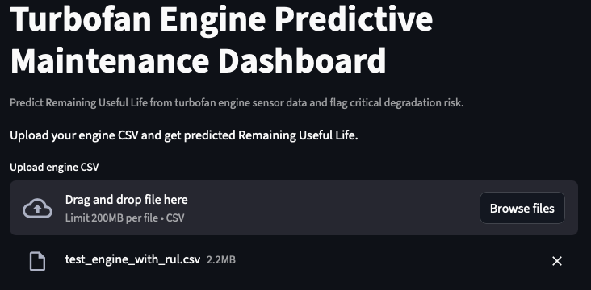
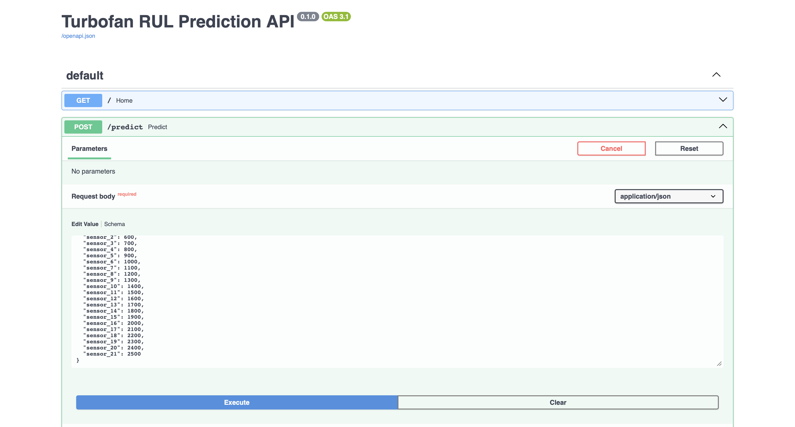
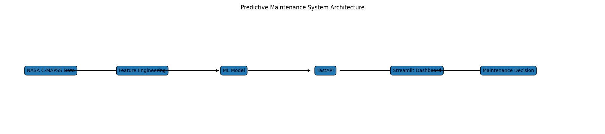
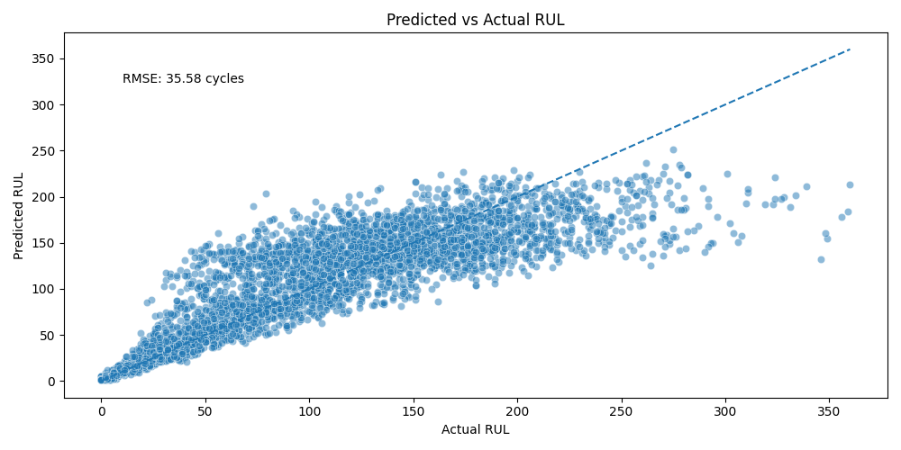
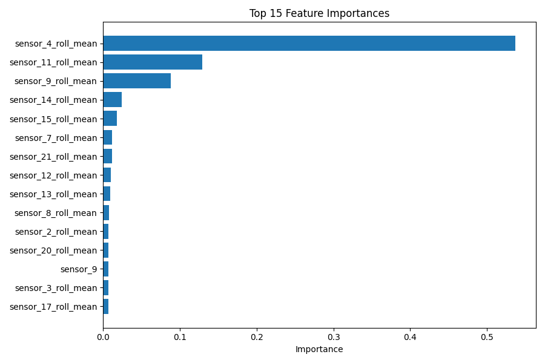
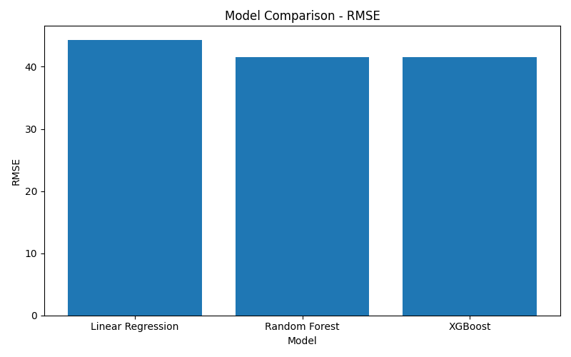
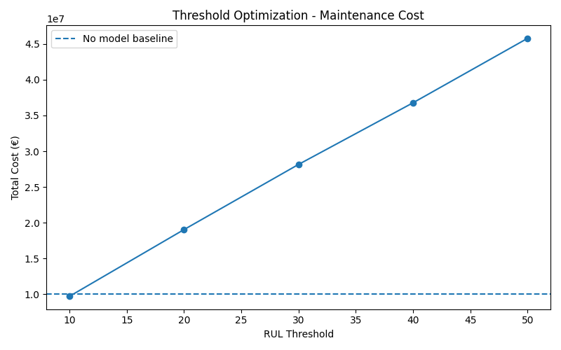

# 🚀 Predictive Maintenance – Turbofan RUL Prediction (NASA C-MAPSS)

[](https://turbofan-rul-dashboard.streamlit.app)
[]()
[]()

---

## 🚀 Live Demo

Try the deployed dashboard here:

👉 https://turbofan-rul-dashboard.streamlit.app

---

## 📸 Dashboard Preview

### RUL Predictions & Trends


### API Interface (FastAPI)


---

## 📌 Overview

This project uses machine learning on NASA’s **C-MAPSS dataset** to estimate Remaining Useful Life (RUL), identify engines at risk of failure, and support maintenance decisions through an interactive dashboard, FastAPI endpoint, and cost-based threshold optimization.

> The system goes beyond prediction by integrating machine learning, decision logic, and cost optimization to approximate real-world industrial maintenance strategies.

---

## 🧩 System Architecture



The system separates data processing, modeling, and deployment layers, enabling real-time inference and scalable integration into industrial workflows.

---

## 💼 Why This Matters

Unplanned equipment failure is extremely costly in industries like aviation and energy.

Predictive maintenance enables:
- Early detection of failures
- Reduced operational downtime
- Lower maintenance costs
- Improved safety and reliability

---

## 🎯 Key Results

- Built a complete predictive maintenance pipeline (data → model → dashboard)  
- Estimated Remaining Useful Life (RUL) from real-world turbofan data  
- Achieved validation **RMSE ≈ 35.6 cycles** after time-series feature engineering 
- Developed an interactive **Streamlit dashboard** for real-time predictions  
- Deployed an end-to-end ML system (dashboard + API) for real-time inference and maintenance decision support  
- Reduced maintenance cost by optimizing decision threshold (RUL = 10 cycles), outperforming baseline strategy
  
---

## 📊 Model Performance



**RMSE:** 35.6 cycles  

### Insight

Introducing time-series features (rolling mean, rolling std, and trends) significantly improved model performance from ~41 cycles to ~35.6 cycles.

This highlights that engine degradation is inherently temporal, and capturing historical behavior is critical for accurate Remaining Useful Life prediction.

---

## 🔍 Feature Importance



### Insight

A small subset of engineered features dominates the prediction, particularly rolling statistics of key sensors.

This indicates that temporal degradation patterns are concentrated in specific signals, which the model leverages strongly.

---

## 📊 Model Comparison

| Model | RMSE |
|------|------|
| Linear Regression | 44.34 |
| Random Forest (baseline) | 41.52 |
| Random Forest (time-series features) | 35.6 |
| XGBoost | 41.49 |



### Insight

Tree-based models outperform linear regression, confirming the nonlinear nature of degradation.

However, performance gains between Random Forest and XGBoost are limited, indicating that feature engineering (especially time-series features) is the main driver of performance improvement.

---

## ⏱ Time-Series Feature Engineering

To better capture degradation patterns over time, additional features were engineered:

- Rolling mean (window = 5 cycles)
- Rolling standard deviation
- Sensor trend (cycle-to-cycle variation)

These features allow the model to capture temporal dynamics of engine degradation.

### Impact

Introducing time-series features improved model performance:

- RMSE reduced from ~41 cycles → ~35.6 cycles

This confirms that system degradation is inherently temporal and cannot be effectively modeled using static features alone.

---

## 🛠 Maintenance Decision Logic

Predicted RUL is translated into operational actions:

- RUL < 20 cycles → Immediate maintenance required  
- RUL < 50 cycles → Schedule maintenance soon  
- RUL ≥ 50 cycles → Normal operation  

This bridges the gap between machine learning predictions and real-world maintenance decision-making.

---

## 🧠 Methodology

- Loaded and processed NASA C-MAPSS dataset  
- Computed Remaining Useful Life (RUL) per engine cycle  
- Used **21 sensors + 3 operational settings** with rolling statistics and trend-based features   
- Split dataset into training and validation sets  
- Trained and compared **Linear Regression, Random Forest, and XGBoost models**  
- Applied **GridSearchCV** for hyperparameter tuning  
- Evaluated using RMSE and visual analysis  

---

## 💰 Business Impact & Threshold Optimization



A simplified cost model was used:

- Failure cost: 100,000 €  
- Preventive maintenance cost: 10,000 €  

### Results

| Threshold | Total Cost (€) |
|----------|----------------|
| No model | 10,000,000 |
| 10 | **9,690,000** |
| 20 | 19,030,000 |
| 30 | 28,150,000 |
| 40 | 36,780,000 |
| 50 | 45,800,000 |

**Optimal threshold (RUL = 10 cycles) reduces total cost below baseline.**

### Insight

Predictive maintenance does not automatically reduce costs.

Without proper decision thresholds, the system can trigger excessive maintenance and increase operational cost.

By optimizing the maintenance threshold, total cost was reduced below the baseline, demonstrating that predictive maintenance is both a modeling and a decision optimization problem.

---

## 🛠 Features

- End-to-end machine learning pipeline  
- Time-series feature engineering (rolling statistics, trends) 
- Hyperparameter tuning with cross-validation  
- Visualization of predicted vs actual RUL  
- Interactive dashboard for real-time predictions  
- FastAPI deployment for real-time inference  
- Maintenance decision logic based on predicted RUL  
- Demo dataset generator for quick testing  

---

## ⚙️ API (FastAPI)

This project includes a deployable API for real-time RUL prediction.

### Run locally

```bash
uvicorn src.api.main:app --reload
```

### Endpoints

- `GET /` → health check
- `POST /predict` → predict Remaining Useful Life from sensor data

### Example Output

```json
{
  "predicted_rul": 168.34,
  "decision": "Normal operation"
}
```

---

## 🧪 How to Run

### 1. Clone the repository
```bash
git clone https://github.com/hassanattout/turbofan_predictive_maintenance.git
cd turbofan_predictive_maintenance
```

### 2. Install dependencies
```bash
python3 -m pip install -r requirements.txt
```

### 3. Train the model
```bash
python3 src/training/train_model.py
```

### 4. Launch the dashboard
```bash
streamlit run src/dashboard/app.py
```

---

## 🗂️ Repository Structure

```text
turbofan_predictive_maintenance/
│
├── src/
│   ├── api/
│   │   └── main.py
│   ├── dashboard/
│   │   └── app.py
│   ├── training/
│   │   ├── train_model.py
│   │   └── predict.py
│   └── utils/
│       └── generate_visuals.py
│
├── data/
│   └── raw/
│       └── CMAPSSData/
│
├── models/
│   └── rf_model.pkl
│
├── visuals/
├── experiments/
│
├── README.md
├── requirements.txt
├── LICENSE
└── .gitignore
```

---

## ⚠️ Notes

The trained model is stored in `models/rf_model.pkl`.

If the model file is missing, train it with:

```bash
python3 src/training/train_model.py
```

Place the NASA C-MAPSS dataset inside:
data/raw/CMAPSSData/
---

## 📌 Future Improvements

- Explore deep learning-based time-series models (LSTM / GRU) to capture temporal dependencies more directly  
- Use additional datasets (FD002–FD004) for more complex degradation scenarios  
- Add SHAP-based model explainability  
- Add alerting system for low RUL engines  
- Improve deployed dashboard UI and add downloadable prediction reports  

---

## 👨‍💻 Author
Hassan Attout  
Machine Learning & Energy Systems    
LinkedIn: https://www.linkedin.com/in/hassanattout

---

## 📄 License

This project is licensed under the MIT License.

