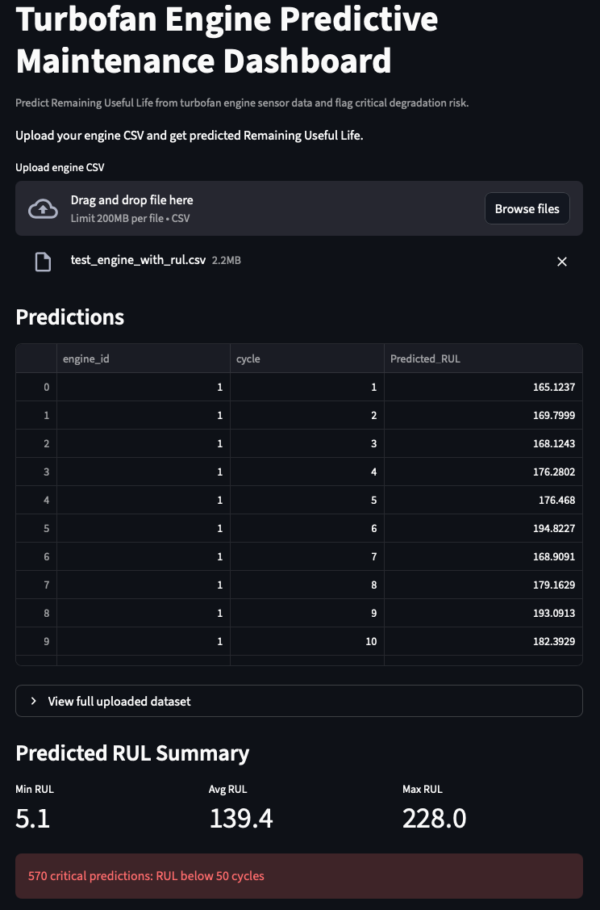
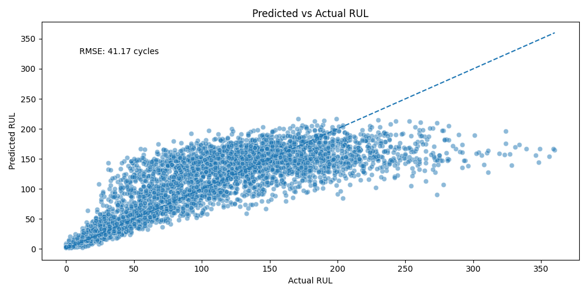

# 🚀 Predictive Maintenance – Turbofan RUL Prediction (NASA C-MAPSS)

[](https://turbofan-rul-dashboard.streamlit.app)
[]()
[]()

---

## 🚀 Live Demo

Try the deployed dashboard here:

👉 https://turbofan-rul-dashboard.streamlit.app

---

## 📸 Dashboard Preview

### RUL Predictions & Trends


---

## 📌 Overview

This project uses machine learning on NASA’s **C-MAPSS dataset** to estimate Remaining Useful Life (RUL) and identify engines at risk of failure through an interactive dashboard.


---

## 💼 Why This Matters

Unplanned equipment failure is extremely costly in industries like aviation and energy.

Predictive maintenance enables:
- Early detection of failures
- Reduced operational downtime
- Lower maintenance costs
- Improved safety and reliability

This project demonstrates how machine learning can be applied to solve this real-world problem.

---

## 🏭 Use Case

Applicable to aviation, energy systems, and industrial predictive maintenance where early failure detection is critical.

---

## 🎯 Key Results

- Built a complete predictive maintenance pipeline (data → model → dashboard)  
- Estimated Remaining Useful Life (RUL) from real-world turbofan data  
- Achieved validation performance of **RMSE ≈ 41 cycles**  
- Developed an interactive **Streamlit dashboard** for real-time predictions  
- Demonstrated application of machine learning to real-world industrial systems
---

## 📊 Model Performance



**Insight:**  
The model captures general degradation trends effectively. Variance increases near end-of-life, reflecting real-world uncertainty in failure prediction.

---

## 🧠 Methodology

- Loaded and processed NASA C-MAPSS dataset  
- Computed Remaining Useful Life (RUL) per engine cycle  
- Used **21 sensors + 3 operational settings** as features  
- Split dataset into training and validation sets  
- Trained a **Random Forest Regressor**  
- Applied **GridSearchCV** for hyperparameter tuning  
- Evaluated using RMSE and visual analysis  

---

## 🛠 Features

- End-to-end machine learning pipeline  
- Automated RUL computation from time-series data  
- Hyperparameter tuning with cross-validation  
- Visualization of predicted vs actual RUL  
- Interactive dashboard for inference on new data  
- Demo dataset generator for quick testing  

---

## 🧪 How to Run

### 1. Clone the repository
```bash
git clone https://github.com/hassanattout/turbofan_predictive_maintenance.git
cd turbofan_predictive_maintenance
```

### 2. Install dependencies
```bash
pip install -r requirements.txt
```

### 3. Train the model
```bash
python3 turbofan.py
```

### 4. Launch the dashboard
```bash
streamlit run app.py
```

---

## 🗂️ Repository Structure

```text
turbofan_predictive_maintenance/
│
├── CMAPSSData/                     # NASA dataset (optional for retraining)
├── figures/                        # Additional plots
├── models/                         # Trained model (rf_model.pkl)
│
├── .gitignore                      # Ignore large/local files
├── LICENSE
├── README.md                       # Project documentation
│
├── app.py                          # Streamlit dashboard
├── generate_test_csv_with_rul.py   # Demo dataset generator
├── predicted_vs_actual_RUL.png     # Model performance visualization
├── requirements.txt                # Dependencies
├── test_engine_with_rul.csv        # Sample input data
├── turbofan.py                     # Model training pipeline
```

---

## ⚠️ Notes

The trained Random Forest model is stored in `models/rf_model.pkl`.
If running locally and the model file is missing, run `python3 turbofan.py` to regenerate it.
Place the NASA C-MAPSS dataset inside `CMAPSSData/` if retraining the model.

---

## 📌 Future Improvements

- Implement time-series models (LSTM / GRU)
- Use additional datasets (FD002–FD004)
- Improve feature engineering and sensor selection
- Add alerting system for low RUL engines
- Improve deployed dashboard UI and add downloadable prediction reports

---

## 💡 About

This project demonstrates how machine learning can be applied to predictive maintenance in industrial systems.

It highlights the potential of data-driven approaches to:

- anticipate failures
- optimize maintenance schedules
- improve system reliability

---

## 👨‍💻 Author
Hassan Attout  
Machine Learning & Energy Systems    
LinkedIn: https://www.linkedin.com/in/hassanattout

---

## 📄 License

This project is licensed under the MIT License.

