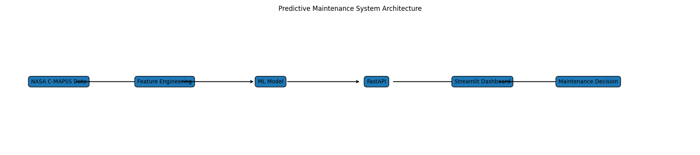

# Turbofan Remaining Useful Life Prediction

[](https://turbofan-rul-dashboard.streamlit.app)
[](https://github.com/hassanattout/turbofan_predictive_maintenance/actions/workflows/ci.yml)

An educational predictive-maintenance system built with NASA C-MAPSS turbofan degradation data. The project combines causal temporal feature engineering, engine-level validation, a Streamlit dashboard and a FastAPI inference interface.

> This is a research and portfolio demonstration. It is not an aviation-certified maintenance or safety system.

## Why the methodology matters

Turbofan datasets contain many correlated cycles from each engine. Randomly splitting individual rows can place cycles from the same engine in both training and validation, producing an overly optimistic score.

This project therefore holds out complete engines with `GroupShuffleSplit`. No engine ID is allowed to appear in both partitions.

The model uses five-cycle rolling statistics and sensor trends. The API also requires an ordered history of at least five observations, preventing training-serving skew caused by replacing temporal features with fabricated zeros.

## Architecture

```text
NASA C-MAPSS history
        ↓
Causal per-engine features
        ↓
Complete-engine train/validation split
        ↓
Random Forest RUL model
        ↓
FastAPI + Streamlit
```



## Features

- Remaining Useful Life target construction
- 21 sensor signals and three operating settings
- Per-engine rolling mean and standard deviation
- Per-engine cycle-to-cycle trends
- Complete-engine validation holdout
- FastAPI prediction from ordered sensor histories
- Streamlit exploration and risk-threshold demonstration
- Automated tests for engine isolation and feature consistency

## Evaluation status

The earlier row-level validation result of approximately 35.6 cycles was produced with a split that could place observations from the same engine in both partitions. It is intentionally not presented as the current validated result.

After downloading C-MAPSS FD001, rerun:

```bash
python src/training/train_model.py
```

The script will report RMSE on complete held-out engines and regenerate the validation figure. This README should only be updated with that new score after the corrected run completes.

## Run locally

```bash
git clone https://github.com/hassanattout/turbofan_predictive_maintenance.git
cd turbofan_predictive_maintenance
python -m venv .venv
source .venv/bin/activate
pip install -r requirements.txt
```

Place the NASA FD001 files under:

```text
data/raw/CMAPSSData/
├── train_FD001.txt
├── test_FD001.txt
└── RUL_FD001.txt
```

Train the model:

```bash
python src/training/train_model.py
```

Run the dashboard:

```bash
streamlit run app.py
```

Run the API:

```bash
uvicorn src.api.main:app --reload
```

Run tests:

```bash
pytest -q
```

## API contract

`POST /predict` accepts an ordered list of at least five readings:

```json
{
  "readings": [
    {
      "setting_1": 0.0,
      "setting_2": 0.0,
      "setting_3": 100.0,
      "sensor_1": 518.67,
      "sensor_2": 641.82,
      "sensor_3": 1589.7,
      "sensor_4": 1400.6,
      "sensor_5": 14.62,
      "sensor_6": 21.61,
      "sensor_7": 554.36,
      "sensor_8": 2388.06,
      "sensor_9": 9046.19,
      "sensor_10": 1.3,
      "sensor_11": 47.47,
      "sensor_12": 521.66,
      "sensor_13": 2388.02,
      "sensor_14": 8138.62,
      "sensor_15": 8.4195,
      "sensor_16": 0.03,
      "sensor_17": 392,
      "sensor_18": 2388,
      "sensor_19": 100,
      "sensor_20": 39.06,
      "sensor_21": 23.419
    }
  ]
}
```

The example is abbreviated conceptually: supply at least five complete objects ordered from oldest to newest.

## Limitations

- The current model is a Random Forest, not a sequence neural network.
- Results are dataset and operating-condition specific.
- The decision thresholds are illustrative and require operational validation.
- The cost simulation uses assumed costs, not measured business savings.
- The dashboard does not replace maintenance engineering judgment.
- Official C-MAPSS test-set evaluation and the NASA asymmetric score remain future improvements.

## Author

Hassan Attout  
Mechanical engineer focused on energy systems, industrial AI and ML deployment  
[LinkedIn](https://www.linkedin.com/in/hassanattout)

## License

MIT
